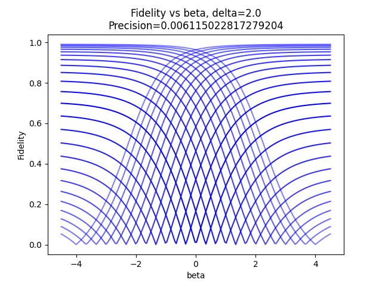

# TODOs:
- [ ] Various pulse shapes
- [ ] Plot pulse and detuning
- [ ] Separate animation file
- [ ] Fix factor of 2
- [ ] Add assertion for integration cutoff (ensure sech is near zero at bounds)
- [ ] compile in C with string hamiltonian

Here is an animation for the beta=0 pulse:

We measure fidelity from initial state (ground state) to find 
where the system is fully excited. This would correspond to a value of $\beta$ matching the detuning:
$\beta=-2\Delta$.

Here is the fidelity as a function of beta (magnetometer):

And at finite temperature, with various detunings:

Here is the "error" (width at 1% fidelity) as a function of beta (magnetometer):

