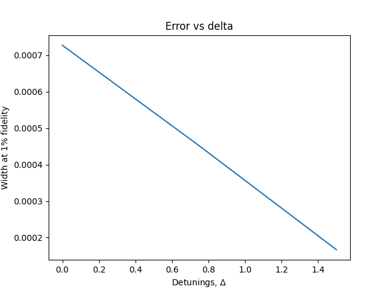

# TODOs:
- [ ] Various pulse shapes
- [ ] Plot pulse and detuning
- [ ] Separate animation file
- [ ] Fix factor of 2
- [ ] Add assertion for integration cutoff (ensure sech is near zero at bounds)
- [ ] compile in C with string hamiltonian

Here is an animation for the beta=0 pulse:

Here is the fidelity as a function of beta (magnetometer):

Here is the "error" (width at 99%) as a function of beta (magnetometer):

